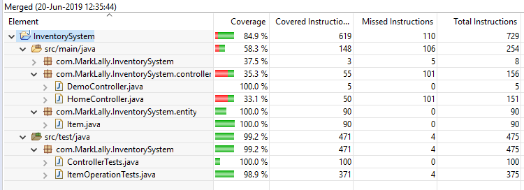

# Inventory System

A simple web interface for performing CRUD operations on a lightweight, in-memory database.

## Usage

After cloning, cd into project root directory and run:

```bash
./mvnw spring-boot:run
```
Additionally you can launch from the executable JAR file located in /target

```bash
cd /target
java -jar InventorySystem-0.0.1-SNAPSHOT.jar
```


Open a browser to [localhost:8082](localhost:8082) to interact with the app.

## Notes

- Max inventory size is 200. The 'Add Item' button will become disabled at this max capacity.

- Max count per item is 5. Additional attempts to add items past this limit will fail.

- Persistence: H2
- Framework  : Spring Boot
- Templating : Thymeleaf

## Coverage



